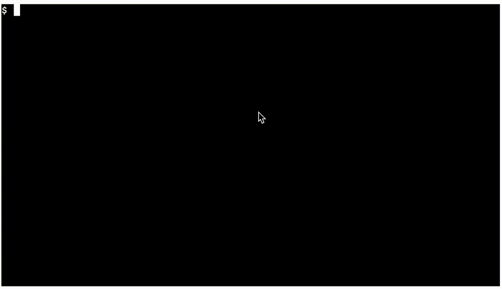

# Wasmer-JS [](https://github.com/prettier/prettier) [](https://dev.azure.com/wasmerio/wasmer-js/_build/latest?definitionId=4&branchName=master) [](https://david-dm.org/wasmerio/wasmer-js?type=dev)

<!-- [](https://greenkeeper.io/) -->
<!-- [](https://coveralls.io/github/wasmerio/wasmer-js)  -->

Wasmer-JS is a mono-repo of multiple JavaScript packages enabling easy use of [WebAssembly](https://webassembly.org) Modules in Node and the Browser.

- [`@wasmer/wasi`](./packages/wasi) - WebAssembly WASI implementation for Node and browsers.

- [`@wasmer/cli`](./packages/cli) - WebAssembly WASI CLI for Node.js (`wasmer-js`)

- [`@wasmer/wasmfs`](./packages/wasmfs) - WASI/Wasm FileSystem.

- [`@wasmer/io-devices`](./packages/io-devices) - Implementation Support for the Wasmer Experimental I/O Devices for Wasmer-JS.

- [`@wasmer/wasm-transformer`](./packages/wasm-transformer) - the JS interface for the [`wasm_transformer` crate](./crates/wasm_transformer)

- [`@wasmer/wasm-terminal`](./packages/wasm-terminal) - A browser terminal/shell for interacting with WASI/Wasm Modules. It powers [WebAssembly.sh](https://webassembly.sh/).

## Documentation

Documentation for the Wasmer-JS Stack, can be found on the [Wasmer Docs](https://docs.wasmer.io/integrations/js/reference-api).

## Development

Contributing into Wasmer-JS it's very easy, just clone the repo and run:

```bash
npm install
npm run build
```

> **NOTE:** This will run `lerna bootstrap`, and bootstrap the JS Packages.

To start **development mode**, you can run the `dev` command:

```bash
npm run dev
```

This will serve the `examples/wasm-shell` example, which can be accessed with: http://localhost:1234/



## Building the project

To build all the packages in the project, you can run the `build` command:

```bash
npm run build
```

This will bundle JS Packages into `./dist` directory.

## Tests

To make changes to any of the sub projects, they can be tested by either: Running their local tests with `npm run test` in their respective package directory, or running it the root:

```bash
npm run test
```

## Contributing

For additional contribution guidelines, please see our [CONTRIBUTING.md](./CONTRIBUTING.md) and our [Code of Conduct](./code-of-conduct.md).

### Using Lerna

Please see the website for [lerna](https://lerna.js.org/) for a quick introduction into what it is. Here are some general notes about using lerna in this project:

- Packages can be added by simply creating a new directory within the `packages/` directory, and running `npm init` in this new package directory. Then, the new package must be botstraped using learna. For this project, this can be done running `npm run lerna:bootstrap` in the base project directory.

- To add new dependencies and keep build times low, `devDependencies` ([not CLI dependencies](https://github.com/lerna/lerna/issues/1079#issuecomment-337660289)) must be added to the root [package.json](./package.json) file. Project installation / runtime dependencies are managed for each package individually.

- Sibling JS packages can depend on one another. You can do this by using [@lerna/add](https://github.com/lerna/lerna/pull/1069). For example, `lerna add @wasmer/package-1 --scope=@wasmer/package-2` will add @wasmer/package-1@^1.0.0 to @wasmer/package-2. However, there are issues when a **published package** tries to depend on a new **unpublished package**, please see [this issue](https://github.com/lerna/lerna/issues/2011) for the discussion. And, one should not be afraid of `learna link convert`, as `file://` dependencies will be automatically converted by lerna on publish, for example [see here](https://github.com/lerna/lerna/issues/1588#issue-352232646).
